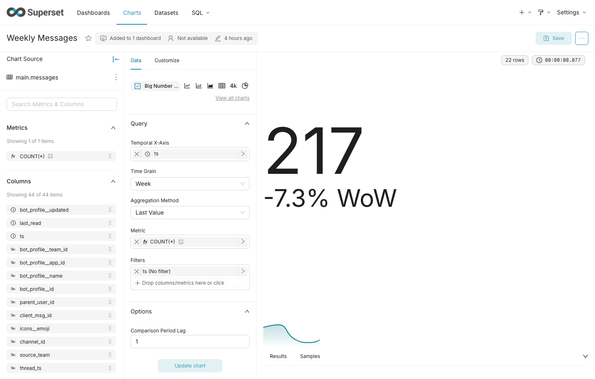
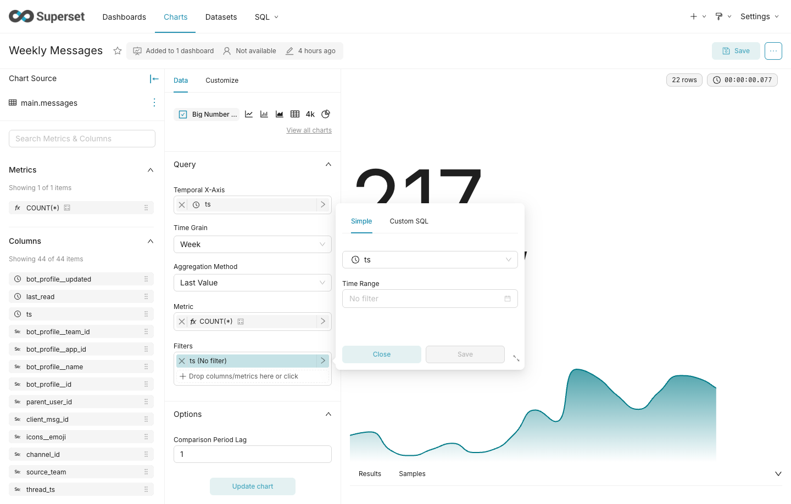
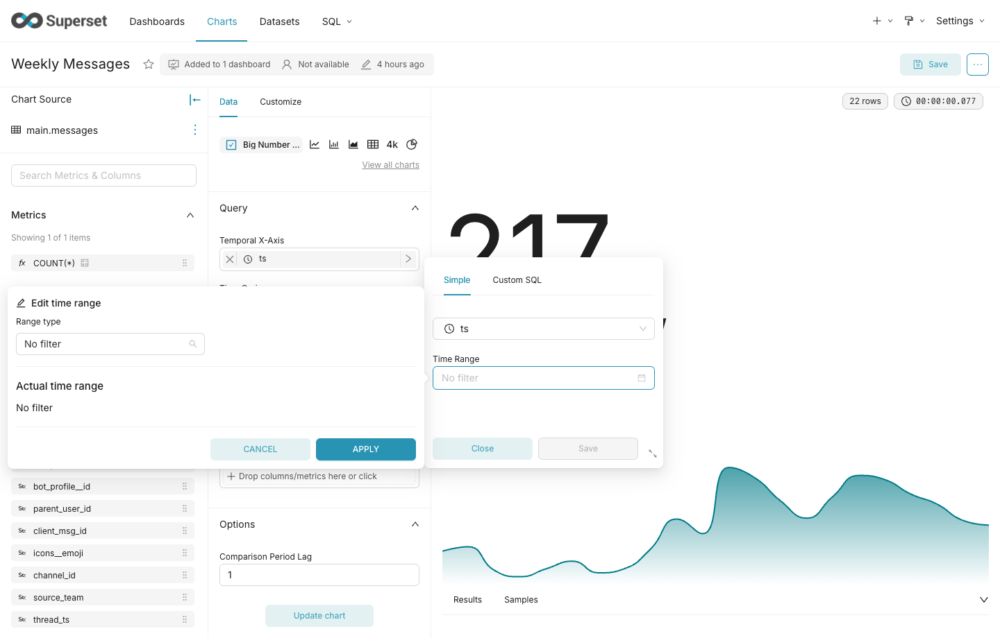
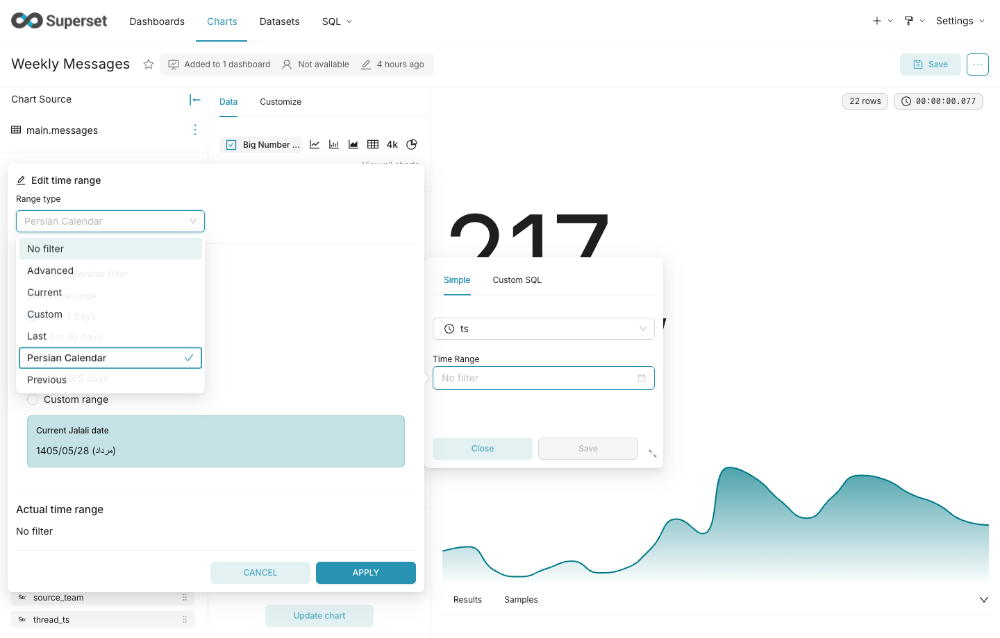
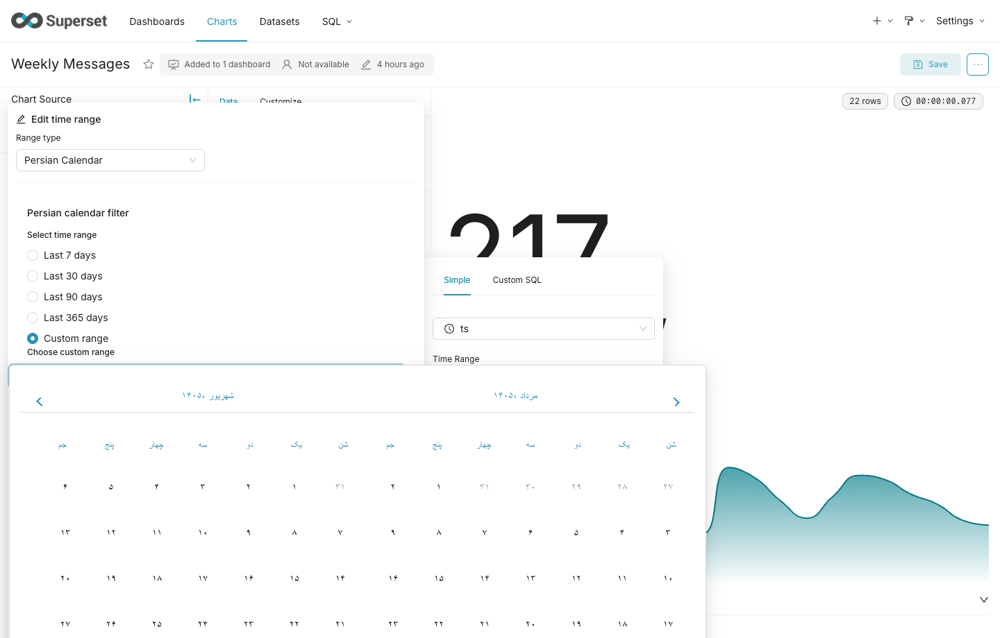

# تقویم شمسی برای Apache Superset

این یک **افزونهٔ جامعه‌محور** است؛ مثل بقیهٔ افزونه‌ها و ویژوال‌هایی که روی Superset ساخته می‌شوند. محصولی که اجرا می‌کنید همان Superset است. این مخزن کنترل **Persian Calendar** را به فیلتر زمانی Explore و داشبورد اضافه کرده است.

نسخهٔ انگلیسی: [README.md](README.md)

## فرمت ستون تاریخ

تقویم شمسی فقط در **رابط کاربری** است. مقدار ذخیره‌شده در دیتابیس باید **میلادی** باشد.

ستون را در دیتاست به‌صورت Datetime علامت بزنید (آیکون ساعت). اگر مقدار ستون شمسی باشد (مثل `1403/01/01`) فیلتر درست کار نمی‌کند.

| درست | نادرست |
|------|--------|
| نوع SQL: `DATE`، `TIMESTAMP`، `TIMESTAMPTZ`، `DATETIME` | رشتهٔ شمسی مثل `1403-01-01` یا `1403/01/01` |
| مقدار نمونه: `2024-03-20` یا `2024-03-20 08:00:00` | فقط رقم فارسی بدون تبدیل به میلادی |

مثال: اول فروردین ۱۴۰۳ در دیتابیس می‌شود `2024-03-20`.

کوئری فیلتر هم میلادی می‌رود، مثلاً:

```text
2024-03-20 : 2024-04-18
```

در Explore ستون زمانی با آیکون ساعت دیده می‌شود (اینجا `ts`):



## نحوهٔ استفاده

### ۱. چارت را در Explore باز کنید

چارت را باز کنید. فیلتر زمانی معمولاً زیر **Filters** است؛ مثلاً `ts (No filter)`.


### ۲. فیلتر زمان را باز کنید

روی فیلتر ستون زمانی کلیک کنید تا پنجرهٔ Simple باز شود، بعد **Time Range** را بزنید.



### ۳. Range type را روی Persian Calendar بگذارید

در **Edit time range** از لیست **Range type** گزینهٔ **Persian Calendar** را انتخاب کنید.





### ۴. بازه را انتخاب کنید

- نسبی: Last 7 / 30 / 90 / 365 days
- سفارشی: **Custom range** و انتخاب تاریخ در تقویم جلالی

سپس **Apply** و در صورت وجود **Save** روی فیلتر.



## تست‌هایی که گرفته شده

### Jest

| مجموعه | نتیجه |
|--------|--------|
| ابزار Jalali، فریم شمسی، `guessFrame`، DateFilterLabel | پاس |
| DateFilterControl + فایل‌های شمسی | ۶۴ از ۶۴ |
| Native filters + time comparison | ۳۵۴ پاس |
| `src/explore` + `src/filters` | ۸۲۲ پاس |

### Playwright روی Docker در Chrome

روی `http://localhost:8088` با `admin` / `admin`. **۴ از ۴ پاس.**

| تست | توضیح |
|-----|--------|
| لاگین اشتباه | در صفحهٔ ورود می‌ماند |
| لاگین درست | وارد Welcome می‌شود |
| Persian Calendar → Last 30 days | روی چارت Weekly Messages |
| Persian Calendar → بازهٔ سفارشی جلالی | همان چارت، ستون `ts` |

## اجرا

```bash
docker compose up -d
cd superset-frontend && npm run dev-server
```

آدرس: `http://localhost:8088` — ورود: `admin` / `admin`

## مجوز

Apache License 2.0. این مخزن شامل Apache Superset به‌همراه این افزونه است. فایل [LICENSE.txt](LICENSE.txt).
